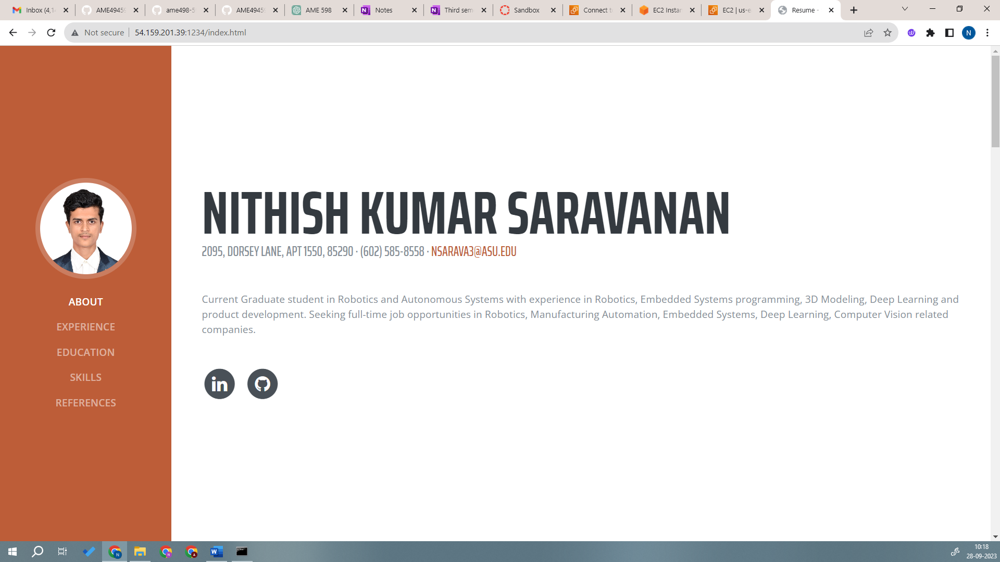
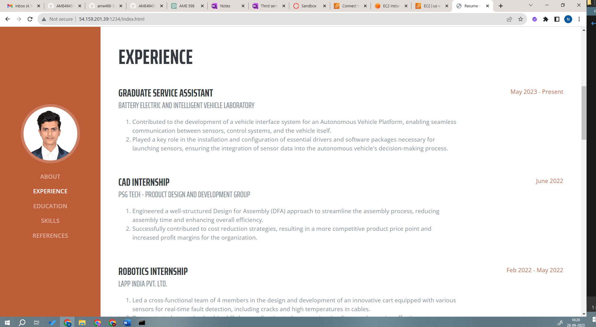
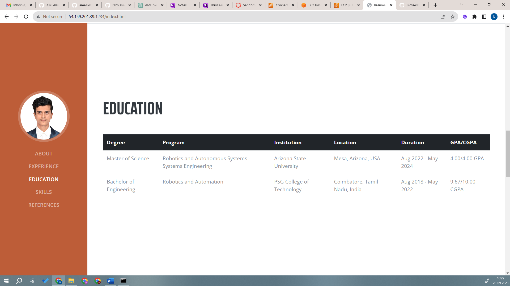
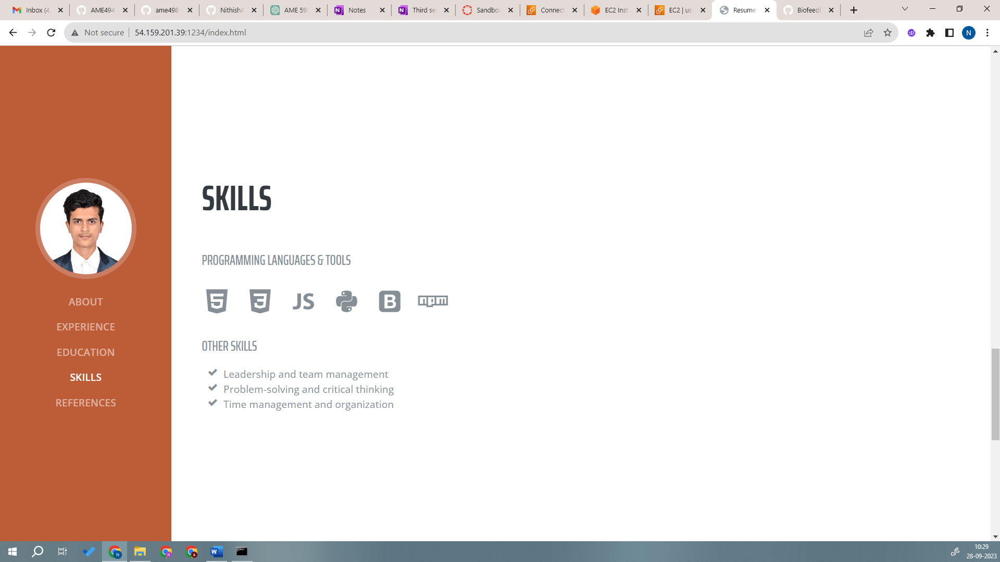
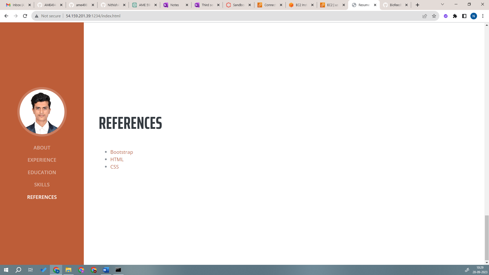

## References:
<ul>
<li><a href="https://www.w3schools.com/html/">HTML reference</a></li>
<li><a href="https://www.w3schools.com/css/">CSS reference</a></li>
<li><a href="https://getbootstrap.com/docs/4.0/content/tables/">Bootstrap reference</a></li>
</ul>

Figure 1 Website Hosting

Figure 2 Website Hosting

Figure 3 Website Hosting

Figure 4 Website Hosting

Figure 5 Website Hosting

